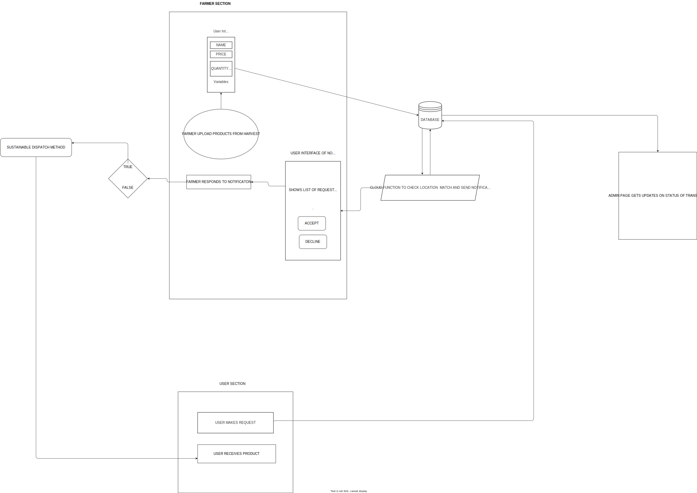

# Itracker Project

The itracker project is an emcompassing food sustainablility project that intends to eliminate food waste conserve the environment and make businesses and individuals thrive with this model.

## Technology Scope

This project is mainly developed using [react-bootstrap](https://react-bootstrap.github.io/getting-started/introduction) package (might need to move to component creation later on)

## Applicaton build practices

## Resources

## Project Flow diagram

To develop this flow diagram you would need to install the [drawio](https://marketplace.visualstudio.com/items?itemName=hediet.vscode-drawio) extension on your IDE
this will allow you to view and edit as at when necessary

