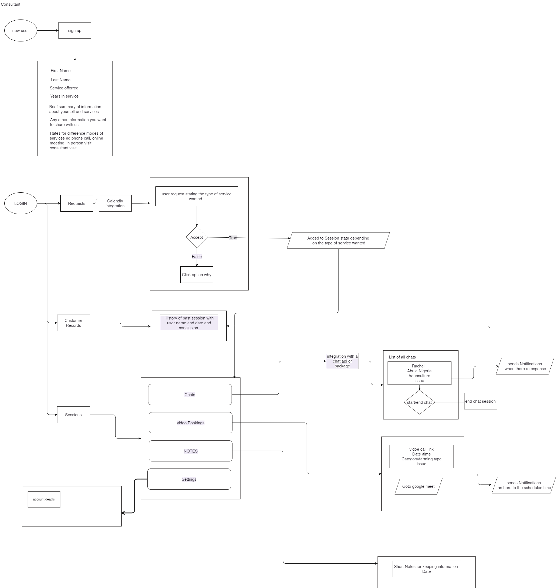

# Itracker Project

The itracker project is an emcompassing food sustainablility project that intends to eliminate food waste conserve the environment and make businesses and individuals thrive with this model.

## Technology Scope

This project is mainly developed using [react-bootstrap](https://react-bootstrap.github.io/getting-started/introduction) package (might need to move to component creation later on)
This project uses react-routerV5 [react-routerV5 documentation](https://v5.reactrouter.com/web/guides/quick-start)
Firebase [firebase build documentation](https://firebase.google.com/docs/build) web-version8
Calendar application used is [FullCalendar package](https://fullcalendar.io/docs/content-injection)

## Applicaton build practices

## Resources

## Project Flow diagram

## Creation of consultant Feature

The user signs in as a consultant. The information stored in the database indicates that the user type is "business_admin". The consultant property is automatically set to "pending" until verification of submitted credentials, after which the consultant property of the user is changed to "active".
The consultant information is also stored in a separate consultant collection, including an isActive property that can be used to disable the consultant if needed.

A consultant can create available events on their calendar using the availabilityOrganiser.js file. These available events are stored in the "consultant" collection as a separate collection of its own.

The consultee can query the database using the consultant's industry type, availability date, and event type. This query is indexed in firestore.

If the consultee is satisfied with the presented information, they can request the available event. This action updates the "status.requesterId" of the document for that calendar event with the consultee's userId.

The consultant then accepts or rejects this request. On acceptance, the "status" of the event is changed to "requestAccepted: true".

This action also creates a new document in the bookings collection within the marketplace collection, using the consultee's Id, for the user with the booked event's Id. The consultee can then makes payment, which changes the "status" property of the document to "completed".

Depending on the type of event booked, if it is a video/call type, the application communicates with the backend deployed on Google App Engine to generate a token for Agora, which is the package used to handle these calls.

The chat event information and data is stored separately in MongoDB and linked with the application deployed on the App Engine.

Upon completion of the event, the consultee can mark it as completed. In the bookings collection under users document in the marketplace collection the eventCompleted property is added and set to true. This action moves the event to the record section of the consultant and consulee navigation.

The chats are separated from other types of events in the User interface.

Socket.io was used to build the chat feature of the application.

The Api for the chat and video call has the following endpoint.

"/api/chats" this is the route for creation of chats which connects the two users
"/api/messages" this leads to the routes and controllers for creating and retreiving messages

"/api/rtctoken" this route generates the token which allow two users to connect via call

To develop this flow diagram you would need to install the [drawio](https://marketplace.visualstudio.com/items?itemName=hediet.vscode-drawio) extension on your IDE
this will allow you to view and edit as at when necessary

> Harvest workflow
> 
> Consultant workflow
> 
> Restaurant workflow
> 
> Supplier workflow
> 
