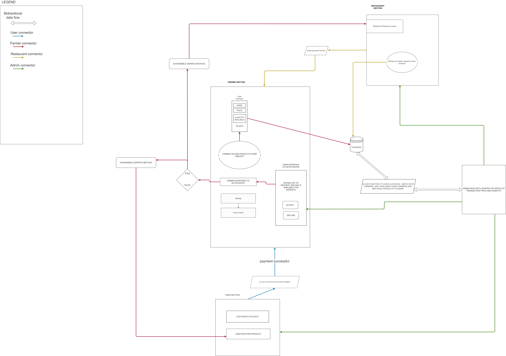
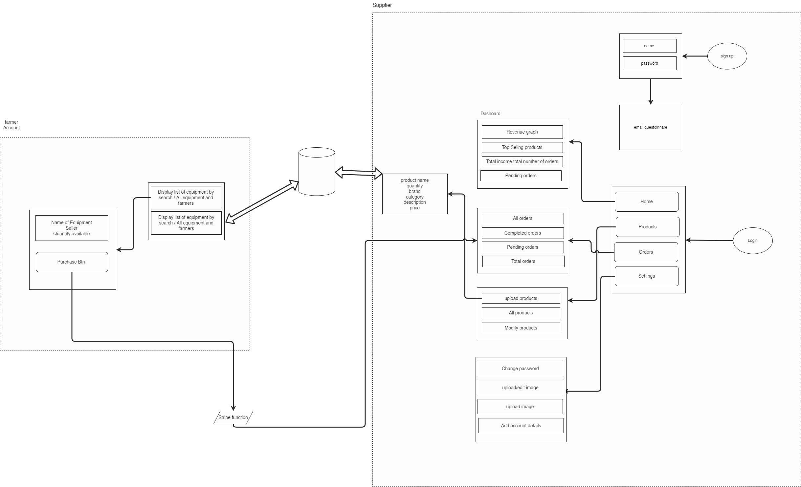

# Itracker Project

The itracker project is an emcompassing food sustainablility project that intends to eliminate food waste conserve the environment and make businesses and individuals thrive with this model.

## Technology Scope

This project is mainly developed using [react-bootstrap](https://react-bootstrap.github.io/getting-started/introduction) package (might need to move to component creation later on)
This project uses react-routerV5 [react-routerV5 documentation](https://v5.reactrouter.com/web/guides/quick-start)
Firebase [firebase build documentation](https://firebase.google.com/docs/build) web-version8
Calendar application used is [FullCalendar package](https://fullcalendar.io/docs/content-injection)

## Applicaton build practices

## Resources

## Project Flow diagram

## Creation of consultant Feature

The user signs in as a consultant the the information stored in the database indicates that the user type is "business_admin" and the consultant property is automatically set to "pending" until approval which the cosultant propery of the user is changed to "active".The consultant information is also stored in a consultant collection with all the the properties including an isActive property which can be used to disable the consultant if need be.

A consultant can create available events on his callendar using the availabilityOrganiser.js file. These available events are stored in the consultant collection as a collection of its own.

The consultee can query using the index which are stored in the database using the type of consultant industry the date of availavilty and the type of event.

If the consultee is satified with what he/she is presented the consultee can then make a request for the available event (this action updates the status of the document of that calendar event with the userId of the consultee).

The consultant then accepts or reject this request. On acceptance the status of this event is changed to "requestAccpeted: true".

This action also created a new document (using the consultee Id) in the bookings collection in the marketplace collection for the user with the id of the event booked. The consultee then makes payment which changes the status of the document to completed.

Depending on the type of event booked? If the event is a video/ call type the application would talk to the backend created in google app engine to generate a token for Agora which is the package used to handle these calls.

The Chat event Type is also generated in a seperate mongodb storage and is linked with the application deployed on the app engine too.

On completion of the event, the consultee can then mark the event as completed. This action moves the event to the record section of the navigation.

The chats are seperated from other types of events.

Socketio was used in building the chat feature of the applicaton.

To develop this flow diagram you would need to install the [drawio](https://marketplace.visualstudio.com/items?itemName=hediet.vscode-drawio) extension on your IDE
this will allow you to view and edit as at when necessary

> Harvest workflow
> 
> Consultant workflow
> 
> Restaurant workflow
> 
> Supplier workflow
> 
